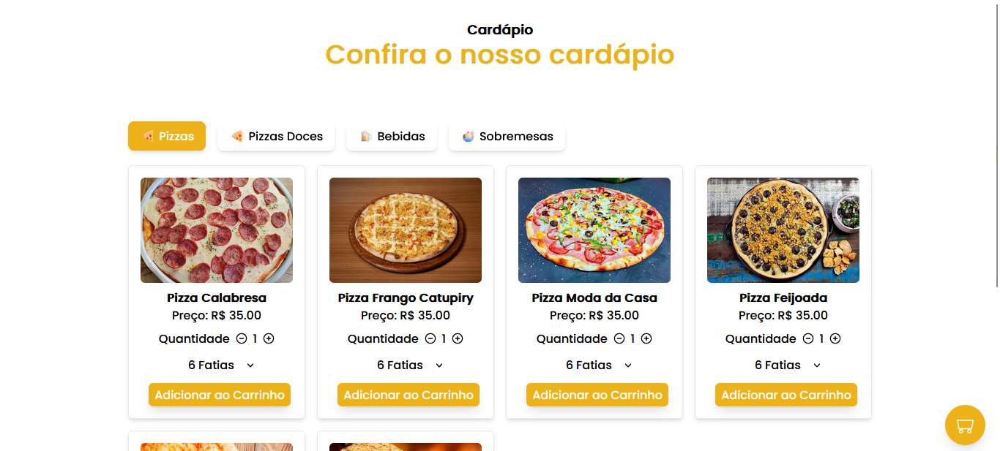

 # Cardapio Online 📝  
  A aplicação que desenvolvi ao longo deste chat é um sistema de pedidos de produtos em uma loja virtual. A aplicação é baseada no framework Next.js e utiliza a biblioteca Tailwind CSS para estilização. Aqui estão os principais componentes e funcionalidades:

## Página Inicial 
- A aplicação possui uma página inicial que exibe uma lista de categorias de produtos. Ao clicar em uma categoria, a lista de produtos correspondente é exibida.

## Componente de Categorias (Categories)
- Este componente é responsável por exibir a lista de categorias de produtos disponíveis. Ele renderiza os botões correspondentes a cada categoria e, ao clicar em uma categoria específica, exibe os produtos relacionados usando o componente "CategoryItems". Através deste componente, os usuários podem navegar entre diferentes categorias e explorar os produtos oferecidos pela loja.

## Componente de Itens da Categoria (CategoryItems)
- Este componente renderiza a lista de produtos para a categoria selecionada. Ele exibe informações sobre cada produto, como nome, preço, quantidade disponível e uma imagem. Os usuários podem adicionar produtos ao carrinho ao clicar em um botão "Adicionar ao Carrinho". Também é possível selecionar o número de fatias de produtos que deseja.

## Componente de Carrinho (Cart)
- Quando os produtos são adicionados ao carrinho, o componente de carrinho exibe os itens selecionados. Cada item no carrinho é exibido com detalhes como nome, quantidade e preço total. Os usuários podem remover itens do carrinho. Se o carrinho estiver vazio, é exibida uma imagem indicando que o carrinho está vazio.

## Botão para Enviar Pedido via WhatsApp
- Quando há itens no carrinho, um botão "Enviar Pedido via WhatsApp" é exibido. Ao clicar neste botão, o texto do pedido é gerado com base nos produtos no carrinho e exibido em uma área de texto.

## Responsividade
- Implementei estilos e layout responsivos usando o Tailwind CSS, permitindo que a aplicação seja visualizada em diferentes tamanhos de tela. O componente de carrinho também é responsivo e se adapta a diferentes dispositivos.

## Comunicação entre Componentes
- Usamos props para passar dados entre os componentes, permitindo que a informação flua de maneira organizada e precisa.

## Funcionalidades de Estado:
- Utilizei hooks de estado (useState) para gerenciar o estado dos componentes, como produtos selecionados, itens no carrinho e se o carrinho está aberto ou fechado.

## Toast de Notificação:
-  Implementei notificações de sucesso usando a biblioteca react-toastify para fornecer feedback visual ao usuário quando um produto é adicionado ao carrinho

